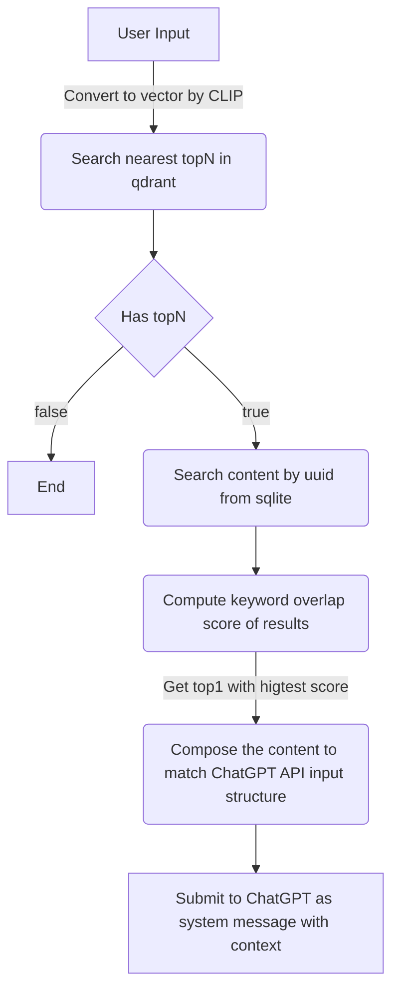

# Emi

A ChatGPT bot with limited long-term memory.

Tip: the main language of this bot is `Simplified Chinese`.

⚠ This project is still working in progress, it's very unstable now. ⚠

## Before Reading

I'm not a professional AI related researcher or a front-line AI related programmer, my professional field is Web (Front-end).

This document may contain some errors. If you do not understand anything or have questions about the content of this document, it's welcome to open an issue to discuss it.

## Background

ChatGPT is a amazing product, but limited by its SaaS business model, it's clear that for a long time in the future, OpenAI will not be able to provide long-term memory services due to the cost considerations.

But thanks to the open ChatGPT API, we may be able to do this in a local client.

## Demo

TODO

## How it works now?

As an Electron project, we are able to combine multiple binaries into the final product, so we added two things here, the one is [`qdrant`](https://qdrant.tech/), a vector database, and the other one is [`clip-as-service-rs`](https://github.com/Rorical/clip-as-service-rs), which can transform text strings into vectors.

Every message that responsed by ChatGPT will be transformed and added into the chat history vector database.

For the better content searching, we also added a `sqlite` database to record all the chat messages in every session.

By combining the content in these two databases, we can do something called `Memory Injection` to let this ChatGPT bot looks like it has a long-term memory, but it's actually limited, we will talk this later.

As first, we will focus on how we do the `Memory Injection`.

### Memory Injection

The ChatGPT API supports to add a `system` message to the session context, it's proper to inject the `Memory Hints` by this type of message.

For every user input, we will do this workflow:



The key processes of this workflow is `search nearest topN from qdrant` and `compute the keyword overlap score of results`.

We used the user input as the search reference to get the nearest topN result from qdrant, this will filter something that not quite matches the input.

If we only chose the top 1 from the vector search results, we found out that the top 1 was always the content text we want.

So we added another indicator called `Keyword Overlap Score` to measure which content is the closest to the user input.

#### Keyword Overlap Score

`Keyword Overlap Score` is really simple to compute, for Simplified Chinese there's a general text segmentation library called [`jieba`](https://github.com/fxsjy/jieba), we use it to cut the user input and the content from searching result, then we will obtain the topN keywords of every content statement and the user input.

The score is actually "how many topN keyword in the content has presented in the topN keywords of the user input", all we do is implemeting a simple counter to count the number.

For more accuracy, in counting, we ignored all the words like `Emi` which is totally non-sense in the sentence.

### Data clean

ChatGPT will reject some questions from user if the question is related to personal privacy or some "unsafe content" in its rules, the rejection will pollute the database and significant affect the accuracy of vector searching. We don't want these things be added into the vector database.

So we need to do filter the response from the ChatGPT, at current we build a simple efficient algorithm to detect which sentence is a rejection.

#### Rejection Detection

With ChatGPT, we can easily get a dict of the common words that it will use to reject user, and also we can let it to rate the words by the emotional intensity.

This is a sample prompt:

```plaintext
我需要你给出20个你常用于拒绝用户的简体中文词汇，并按照情绪激烈程度进行打分，以json数组的格式输出
```

Then we get the result:

```json
[
  { "word": "抱歉", "intensity": 2 },
  { "word": "很遗憾", "intensity": 3 },
  { "word": "暂时无法", "intensity": 4 },
  { "word": "不便", "intensity": 4 },
  { "word": "不方便", "intensity": 5 },
  { "word": "不可能", "intensity": 6 },
  { "word": "无法", "intensity": 6 },
  { "word": "无法满足", "intensity": 7 },
  { "word": "无法达成", "intensity": 7 },
  { "word": "不允许", "intensity": 7 },
  { "word": "不能", "intensity": 8 },
  { "word": "不能同意", "intensity": 8 },
  { "word": "不能满足", "intensity": 8 },
  { "word": "无法接受", "intensity": 9 },
  { "word": "坚决拒绝", "intensity": 9 },
  { "word": "断然拒绝", "intensity": 9 },
  { "word": "决不同意", "intensity": 9 },
  { "word": "绝不可能", "intensity": 9 },
  { "word": "绝无可能", "intensity": 9 },
  { "word": "毫不考虑", "intensity": 10 }
]
```

Then we can use this to judgement whether the response is a rejection.

Actually the words is inaccurate, we added some words that presented in the real response but not the in the dict to the final dict.

In the final dict, all the score will be normalized to the range of [0.0, 2.0] for the further calculation.

We used a very simple formula to calculate the score:

```plaintext
Punish Score = Word Score * Cumulated Length / Total Length * 100
Final Score = 100 - Punish Score
```

If the final score is below `90`, we will regard it as a rejection.

Why use this formula? Because in the real response, if ChatGPT want to reject user, it will always say things like this in the first part of the sentence:

```plaintext
抱歉，这个问题涉及到个人信息
```

```plaintext
对不起，我不能回答你的这个问题
```

The words meaning sorry will be the first word in the sentence in most cases, so we use the position of where the word presented as a weight to calculate the score.

### Prompt works

It's weired that ChatGPT cannot accept the history directly unless you command it at the very beginning.

So we added instruction like `Emi会认可所有与当前对话相关的历史对话记录与记录中包含的客观事实，不会对历史记录表示质疑。`(English translation:
`Emi will recognize all historical conversation records related to the current conversation and the objective facts contained therein, and will not challenge the historical records.`) in the initial prompt.

For the memory injection prompt, it should not contain any extra information beyond the related history, otherwise it will affect the response.

For example, if the prompt is `Emi曾经说过:{history}`(`Emi said before:{history}`)，then ChatGPT may recognize it as `Emi once said it but now she or user has another ideas` after combining it with the user input like `Emi现在应该称呼我为什么呢？`(What should Emi call me now?).

ChatGPT will say sorry for that because it recognize the context as user is blaming or challenging the history, which is not what we want, we want to ChatGPT respond with a clear and certain response based on the history and the user input.

As we tried various forms, we fount out that we should made it just looks like a reference, and we must not to added anything extra to the prompt.

At current, we used `相关的历史记录:{history}` (`Related history: {history}`) as injection prompt, ChatGPT will recognize it as a reference as we expect. If the history content is not that match with the context, ChatGPT will ignore it directly, it will automatically decide to whether use it or not.

## Limitations

Now we can only search one history sentence from the history database and inject it into the session context. So there's such a bunch of limitations:

1. The user input will not be included in the searching, so the information in the user input will lost.
2. We only search one sentence from the history, it cannot contain the information which is separated into multiple sentences.
3. The keyword overlap score is also not that accurate in some cases, especially there's bunch of sentences with same keywords but have different meaning or different information. It will give wrong result.
4. Now the limit to vector search result is `10`, but when the database becomes larger and larger, there's some case that all the results is not we want. The way we currently using vector search may not be that proper.

## Routine

Due to the limitations, to inject a more complete memory instruction, we're planning to build a `Facts` database which based on the session history to improve the memory injection.

## Special Thanks

[@Rorical](https://github.com/rorical), who created [`clip-as-service-rs`](https://github.com/Rorical/clip-as-service-rs) and provided much technique support for this project.

## License

MIT
